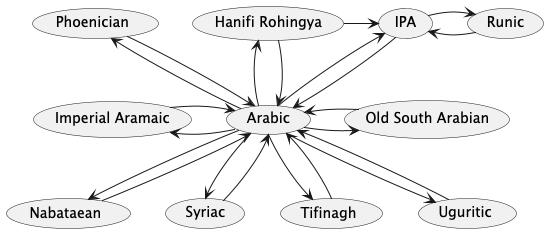

# Abjad-convert Contributing

## Adding New Script
Pull requests are welcome. For adding a new script. Let's say that we want to add a new script "Foo"
- Step #1: create a feature branch from `main` named `abjad-convert/version/0.[x].0` where `x` is the next minor of current version number.
- Step #2: create a new branch that will the previous feature branch when creating the PR.
- Step #3: create a new folder named `foo` in `src`.
- Step #4: add pdf documentation for the script we want to add from www.unicode.org. for example for Ugaritic the file is `U10380.pdf`. this file will be used as a reference
- Step #5: add a new file named `letters.ts` in `foo` folder this file will export
- - `letters` an array of letters written using unicode values with jsdoc each line will contain
    the value of the letter using UTF-16 BE using escape \u followed by four hex digits.
    notice that UTF16BE value is not always the same as the unicode value.
    for example, for letter Alpa in Ugaritic, the unicode value is `0x10380` but the UTF16BE encode value is `0xD800DF80`,
    so either write the value as `'\uD800\uDF80'` or use the `String.fromCodePoint(0x10380)` which more recommended for getting the letter.
    follow the value with jsdoc that contains array index, letter itself, unicode value, and the name of the letter.
    for example, ugaritic looks like this:

```ts
const letters = [
	String.fromCodePoint(0x10380), /** #0  𐎀 U+10380 UGARITIC LETTER ALPA */
	String.fromCodePoint(0x10381), /** #1  𐎁 U+10381 UGARITIC LETTER BETA */
	//...
];
```

- - 'Fo' an alias object called `Fo` short of Foo. this will give an alias for all letters mentioned in the letters array.

for example, ugaritic looks like this:
```ts
export const Ug = {
	Alpa: letters[0], // 𐎀
	Beta: letters[1], // 𐎁
	//...
};
```

- - `foo` an instance of `Script` class, which will be exported
- -  in file `index.ts` return the letter of the new script in side exported function `getLetters()` as follows:
```ts
export function getLetters(script: Abjad): readonly string[] {
	switch (script) {
		// ...
		case Abjad.Foo:
			return foo.letters
		// ...
	}
```
for example, ugaritic looks like this:
```ts
export const ugaritic = new Script(
	Abjad.Ugaritic, // enum value of the script
	false,          // true if the script is right to left
	letters,        // array of letters
)
```

- Step #6: Add the script to the enum `Abjad` in `src/types.ts` file.
  at this point we have finished adding the script, but it is an island script. Meaning that it can't be converted to or from any other script.

- Step #7: To make it convertable, we need at least to have one "from" and one "to" converter to another script.
  the preferred way is to add a converter to and from Arabic script, as it is currently act as a de facto hub script for all abjad scripts.
  Since version 0.6.0 IPA (International Phonetic Alphabet) is added, it is intended to be as a canonical hub script since IPA can cover all sounds.
  however, the converter can be added to and from any script.
  The algorithm for converting will look first for 1-step converter (direct converter) the one that converts from the source to the target, 
  in case there isn't any it will look for 2-steps approach where it can find a middle script,
  after that it will try 3-steps approach, after that it won't look for 4 or more steps, it will basically throw an error.
  As of version 0.10.0, scripts are connected as follows:
  
- - Adding to Arabic: Add file to `foo` folder with name `toArabic.ts` that include a class called FooToArabicConverter that implements `IConverter` interface.
    it should look like this:
```ts
import { IConverter } from '../../types';
import { Fo } from './letters'
import { Ar } from '../arabic/letters'
import { DirectConverter } from '../../DirectConverter'
import { Abjad } from '../../types'

export class FooToArabicConverter extends DirectConverter {
	public readonly from = Abjad.Foo
	public readonly to = Abjad.Arabic
	public convert(fooText: string): string {
		// convert logic here
		// return (araic text)
	}
}
```
- - Add toArabic converter to `converterFactory.ts`
- - - import the new converter in alphabetical order
```ts
//...
import { FooToArabicConverter } from './foo/toArabic'
//...
```
- - - add the converter to converters array in alphabetical order
```ts
const converters: IConverter[] = [
	//...
	new FooToArabicConverter(),
	//...
];
```
- - Add toFoo converter to `arabic` folder with name `toFoo.ts` that include a class called ArabicToFooConverter that implements `IConverter` interface.
    it should look like this:
```ts
import { Ar } from './letters'
import { Fo } from '../foo/letters'
import { DirectConverter } from '../../DirectConverter'
import { Abjad } from '../../types'

export class ArabicToFooConverter extends DirectConverter {
	public readonly from = Abjad.Arabic
	public readonly to = Abjad.Foo

	public convert(arabicText: string): string {
		// convert logic here
		// return (foo text)
	}
}
```
- - Add toFoo converter to `converterFactory.ts` same like above.

- Step #8 add unit test to`test/index.test.ts`.

- Step #9: update for a new version
- - update `CHANGELOG.md` with the new version number and the changes.

- Step #10
- - update `README.md` links of badges in the top.
- - update version in `package.json` file.
- - run yarn to update `yarn.lock` files
- - run test to update coverage badges
- - update a document figure in `doc/converters.puml` file then generate new png image of `doc/converters.png`
