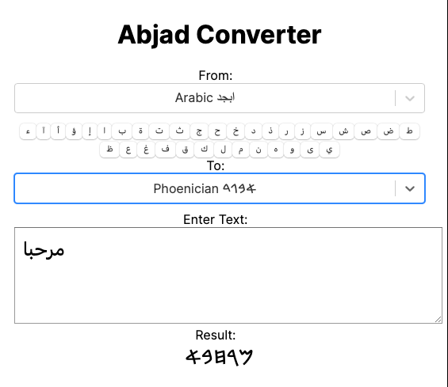

# Abjad web page

A simple web page for Abjad using Next.js v16.

web: [abjad.amerharb.com]()

## Features
- Convert between the supported scripts with an on-screen keyboard
- Dark mode: follows your system preference, with a manual System / Light / Dark toggle
- Deep links: preselect the source and target scripts with the `from` and `to` query
  parameters, e.g. [`?from=ipa&to=arabic`](https://abjad.amerharb.com/?from=ipa&to=arabic).
  Values are the script ids (`ipa`, `arabic`, `hebrew`, `hanifi-rohingya`, …); unknown or
  missing values fall back to the defaults (IPA → Arabic).
